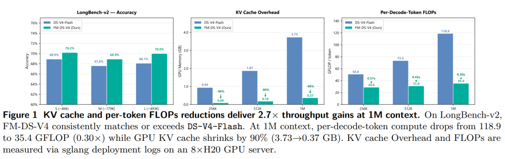
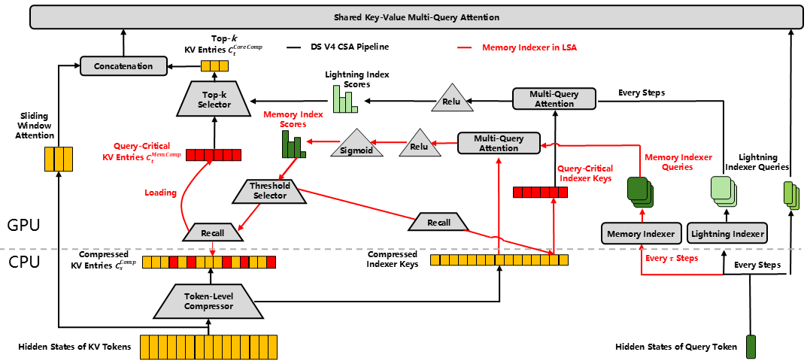
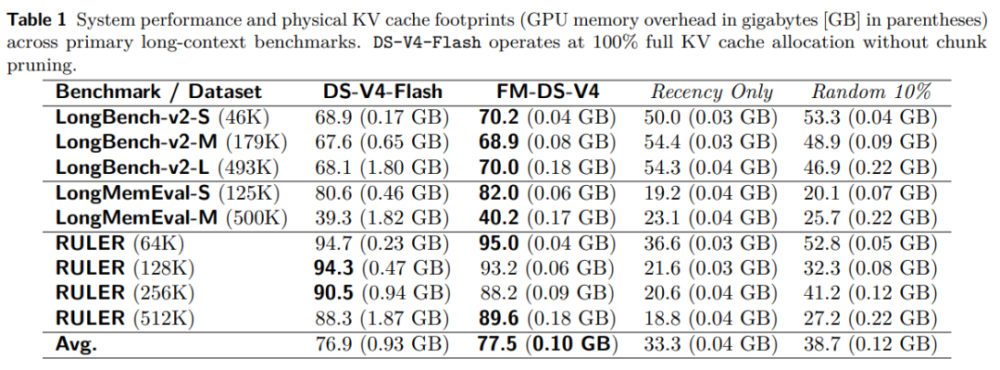

# FlashMemory-DeepSeek-V4

Memory-Indexer retriever for **DeepSeek-V4 Compressed-Sparse-Attention (CSA)** KV-cache.
Replaces the native Lightning Indexer with a lightweight trained retriever — instead of
scoring the full history every decode step, it predicts which ~10–15% of chunks the next
64 tokens will attend to. Only the selected chunks stay on GPU; the rest are offloaded to
CPU.

**[Model weights on Hugging Face](https://huggingface.co/libertywing/FlashMemory-Deepseek-V4)**

## Highlights



**FM-DS-V4 matches or exceeds DS-V4-Flash on long-context accuracy while cutting the serving
cost dramatically.** On LongBench-v2 it is on par with or above the full-attention baseline at
every length (S/M/L). At 1M context it shrinks GPU KV cache by **~90%** (3.73 → 0.37 GB) and drops
per-decode-token compute from 118.9 to 35.4 GFLOP (**0.30×**), which together deliver **2.7×
aggregate throughput** and raise the max concurrency ceiling from 11 to 40 (**3.6×**). The longer
the context, the larger the advantage.

---

## Project structure

```
FlashMemory-Deepseek-V4/
├── sglang/                     # Full modified sglang source (editable install)
├── launch_decode.sh            # D (decode) server — all offload/recall here
├── launch_prefill.sh           # P (prefill) server
├── launch_router.sh            # router (mini load-balancer)
├── data_generation/            # Stage-1: dump training data from a DSv4 server
├── training/                   # Train the Memory-Indexer retriever
├── TECHNICAL_REPORT_en.md      # English technical report
├── TECHNICAL_REPORT_zh.md      # Chinese technical report
└── requirements.txt
```

---

## Quick start (PD-disaggregated high-concurrency)

Three servers: **P** (prefill), **D** (decode — all offload/recall), **router**
(mini load-balancer). Clients connect only to the router at `http://<router>:31503/v1/chat/completions`.

```bash
pip install -e sglang/python
# Also requires sgl_kernel: pip install sgl_kernel==0.3.21

# Download checkpoints from HuggingFace into checkpoints/
```

Key optimizations (all env-gated; gate-off = exact baseline DeepSeek-V4 behavior):

| Optimization | Env variable | What it does |
|---|---|---|
| Path-P (c4 KV offload) | `SGLANG_DECODE_SWAP_P` | c4 classical KV → CPU mirror + GPU reserve |
| Path-I (index-K offload) | `SGLANG_PATHP_INDEX_K_OFFLOAD` | Offload non-target 18 layers' index-K to CPU |
| Two-level recall | `SGLANG_PATHP_SCORE_RESIDENT` | Decode only scores resident set (not full history) |
| Page-recall | `SGLANG_PATHP_PAGE_RECALL` | Page-granular recall (64× smaller page→block table) |
| Cuda-graph | `SGLANG_PATHP_CUDAGRAPH` | Two-level recall inside cuda-graph (~50× faster) |
| Async recall | `SGLANG_PATHP_ASYNC_RECALL` | Recall on background thread, overlaps next 64 steps |
| Fused remap | `SGLANG_PATHP_FUSED_REMAP` | Top-512 columns map directly to reserve cells |

**Startup** (order: D first, then P, then router):

```bash
# 1) D (decode) — on D machine GPU 0–7. 512K config example:
TGT_CONC=60 TGT_CTX=524288 CTX_LEN=1100000 bash launch_decode.sh

# 2) P (prefill) — on P machine GPU 0–7:
CTX_LEN=1100000 SWA_RATIO=0.1 HOST=<P_IP> bash launch_prefill.sh

# 3) router — any machine that can reach P + D:
PREFILL_IP=<P_IP> DECODE_IP=<D_IP> bash launch_router.sh
```

**Reference performance (8×H20 TP8, cross-machine PD, vs baseline standard DSv4; steady-state aggregate decode throughput):**

| Context | KMAX | Ours concurrent / throughput | Baseline concurrent / throughput | Gain concurrent | Gain throughput |
|---------|------|------------------------------|----------------------------------|-----------------|-----------------|
| 256K | 96 | 76 / ~2759 tok/s | 47 / ~1584 tok/s | 1.6× | 1.7× |
| 512K | 192 | 60 / ~2008 tok/s | 25 / ~1028 tok/s | 2.4× | 2.0× |
| 1M | 384 | 30 / ~1266 tok/s | 11 / ~455 tok/s | 2.7× | 2.8× |

`KMAX` (densest pages recalled per request) scales with context to hold ~10% recall coverage
(256K→96 / 512K→192 / 1M→384 pages). Larger KMAX = fuller recall (higher quality) but moves more
pages per recall (lower throughput). At the smaller KMAX=96, 1M reaches ~1537 tok/s (concurrency 40).
Longer context → larger offload advantage. The 1M concurrency ceiling (~40) is bounded by host DRAM
(CPU mirror per request ∝ context), not GPU memory or transfer.

### Per-decode-token FLOPs (whole model)

The constant work (MoE + MLA + compressors + indexer q-proj + LM head, **26.6 GFLOP**) is identical
for baseline and ours. Only the indexer scoring differs: baseline scores the full history `O(context)`,
ours scores only the resident set (`KMAX × 64` chunks, ~10% of history). Whole-model per-token FLOPs:

| Context | KMAX | Baseline | Ours | Ours / Baseline | Saved |
|---------|------|----------|------|-----------------|-------|
| 256K | 96  | 50.8 GFLOP | 28.8 GFLOP | 0.57× | 43.3% |
| 512K | 192 | 73.5 GFLOP | 31.0 GFLOP | 0.42× | 57.8% |
| 1M   | 384 | 118.9 GFLOP | 35.4 GFLOP | 0.30× | 70.2% |

Ours saves the **scoring**, not the attend (both do top-512). Longer context → more saved.

---

## Retriever architecture

Per CSA layer, scores are computed as:

```
hidden [B, 4096]
    → wq_a        (4096 → Q_LORA_RANK)
    → RMSNorm     (q_norm_weight, eps=1e-6)
    → wq_b        (Q_LORA_RANK → N_HEADS * HEAD_DIM)
    → reshape     [B, N_HEADS, HEAD_DIM]
    → RoPE        (YaRN, last ROPE_DIM=64 dims, base=160000)
    → Hadamard    (normalized Walsh-Hadamard)
    → q           [B, N_HEADS, HEAD_DIM]

hidden [B, 4096]
    → weights_proj (4096 → N_HEADS)
    → × weight_scale  (= HEAD_DIM^-0.5 * N_HEADS^-0.5)
    → fused_w     [B, N_HEADS]

compressed_k [B, N, HEAD_DIM + 4] (uint8)
    → bytes[:HEAD_DIM]  viewed as float8_e4m3 → dequant
    → × bytes[HEAD_DIM:]  viewed as float32   → k [B, N, HEAD_DIM]

score = sigmoid( sum_heads( relu(k @ q^T) * fused_w ) )   in [0, 1]
```

### Joint checkpoint + ensemble

The checkpoint holds **three independent CSA layers** (`l10`, `l12`, `l20`),
each with its own weights. At inference time per-layer sigmoid scores are
**ensembled per chunk** — `max` (union, default) or `mean` — to produce a
single keep/drop decision.

### Hyperparameters

| Param | Value |
|-------|-------|
| `N_HEADS` | 128 |
| `HEAD_DIM` | 128 |
| `Q_LORA_RANK` | 2048 |
| `ROPE_DIM` | 64 (last 64 dims) |
| `ROPE_BASE` | 160000 (YaRN) |
| `ROPE_FACTOR` | 16 |
| `ROPE_ORIGINAL_SEQ_LEN` | 65536 |
| `ROPE_BETA_FAST` | 32 |
| `ROPE_BETA_SLOW` | 1 |
| `RMS_NORM_EPS` | 1e-6 |

### `compressed_k` format

Each chunk = `HEAD_DIM + 4 = 132` `uint8` bytes:

| Bytes | Type | Meaning |
|-------|------|---------|
| `[:128]` | `float8_e4m3` | Quantized key values |
| `[128:132]` | `float32` | Per-chunk dequant scale |

Dequant: `fp8_values.view(float8_e4m3).float() * scale`.

---

## Two-level recall algorithm



The figure shows the full pipeline. Black is the stock **DS-V4 CSA pipeline**; red is our
**Memory Indexer** addition. Two indexers cooperate at two cadences:

- **Level 1 — Memory Indexer (red, every `τ` steps).** Our trained retriever scores the full
  history's compressed keys with its own query, and a **Threshold Selector** picks the
  query-critical chunks. Their compressed KV entries are **recalled (loaded) from CPU to GPU**;
  everything else stays offloaded on CPU. This produces the resident set once per cycle.
- **Level 2 — Lightning Indexer (black, every step).** The native indexer scores the (now
  resident) chunks and the **Top-k Selector** keeps top-`k`, which are concatenated with the
  sliding-window entries and fed to the **Shared Key-Value Multi-Query Attention**.

The **GPU / CPU** dividing line is the key to the memory savings: only the recalled query-critical
KV entries and the compressed indexer keys live on GPU, while the bulk compressed KV cache sits on
CPU and is pulled in on demand. Detailed step-by-step:

```
 ┌──────────┐  compress & store    ┌────────────────────────────┐
 │ PREFILL  │  historical K/V      │  CSA KV-cache (the memory) │
 │ (dense   │ ───────────────────► │  N compressed chunks,      │
 │  attn)   │                      │  each = [132] uint8 fp8-K  │
 └────┬─────┘                      └──────────────┬─────────────┘
      │ last hidden state                         │
      ▼                                           │
 ┌────────────── LEVEL 1 (Memory Indexer, every 64 steps) ──────┼──────────────┐
 │ 3 target layers (l10/l12/l20):                                  │              │
 │   ensemble sigmoid scores → threshold + recent + sink          │              │
 │   → resident_set (bool[N], ~10–15% of chunks)                  │              │
 └────────────────────────────────────────────────────────┬───────┘              │
                                                          │                      │
 ┌────────────── LEVEL 2 (Lightning Indexer, every step, all 21 c4 layers) ──┐  │
 │ native top-512 confined to resident_set (non-resident logits → -inf)      │  │
 │ → attend only to recalled chunks                                          │  │
 └───────────────────────────────────────────────────────────────────────────┘  │
                                                                                │
 ┌────────── OFFLOAD (Path-P + Path-I) ──────────────────────────────────────┐  │
 │ c4 classical KV + non-target index-K → CPU mirror                         │  │
 │ GPU holds only recalled pages (resident_set)                              │  │
 └───────────────────────────────────────────────────────────────────────────┘  │
```

1. **Level 1 (Memory Indexer, every 64 steps).** The trained retriever scores the
   full history at the 3 target layers, ensembles per-layer scores, thresholds,
   and keeps recency tail + attention sink → produces a single global `resident_set`.
2. **Level 2 (native Lightning Indexer, every step, all 21 c4 layers).** The
   native indexer's top-512 is confined to the `resident_set` by masking non-resident
   chunk logits to `-inf`. This runs at full throughput inside cuda-graph.
3. **Offload (Path-P + Path-I).** Chunks not in `resident_set` are offloaded to
   CPU mirror. Recalled pages are swapped into a GPU reserve when the resident_set
   changes at cycle boundaries.

---

## Data

Training data is dumped from a DeepSeek-V4 server: for every decode token it records the hidden
state + compressed-K + golden labels (which CSA chunks the next 64 tokens attend to), written as
`doc_*.pkl`. A dump-dedicated sglang server (native DSv4, `--disable-cuda-graph`) drives this.

```bash
# 1) Start the dump server (the script unsets accel env + forces --disable-cuda-graph)
MODEL=/path/to/ds_fp8 TP=8 PORT=30000 bash data_generation/start_dump_server.sh

# 2) Drive it to produce data (absolute --output-dir required; example input has 10 docs)
MODEL_PATH=/path/to/ds_fp8 SGLANG_SERVER_URL=http://127.0.0.1:30000/v1 \
python3 data_generation/run_dump_training_data.py \
  --input data_generation/example_data/creative_writing_multiturn_filtered.subset10.jsonl \
  --output-dir /ABSOLUTE/path/to/generated_data \
  --start-idx 0 --end-idx 10 --thinking --topp 0.6 --min-layers 3 \
  --concurrency 4 --batch-size 10
```

Each `doc_*.pkl` holds `hidden_layer_{L}` [T,4096] bf16, `compk_layer_{L}` [N,132] uint8, and
CSR-format golden labels (`label_indices` / `label_scores` / `label_pointers`) — exactly the format
the trainer expects. Input is JSONL (one `prompt` per line; see `data_generation/README.md` for the
format and the two-pass dump details).

---

## Training

Point a `DATA_CONFIGS` entry (see the `smoke` template in `training/train.py`) at your generated
data directory, then train. The retriever is a joint checkpoint over CSA layers 6/8/10/12/14/16/18/20.

```bash
cd training

# single GPU
python3 train.py --joint-layers 6,8,10,12,14,16,18,20 --data-config smoke \
  --n-heads 128 --q-lora-rank 2048 --lr 1e-4 --focal-loss --neg-ratio 3 \
  --epochs 3 --batch-size 64 --bf16 --num-workers 0 --output-dir ./ckpts

# or multi-GPU DDP (see train_ddp.sh)
bash train_ddp.sh ddp 4 0,1,2,3
```

Labels: `label_interval=64`; positives = union of golden chunks over `[t, t+63]`, negatives sampled
at `neg_ratio`. `verify.py` checks a trained checkpoint against stored logits (Pearson ≥ 0.95).
Pretrained retriever weights are on Hugging Face
([libertywing/FlashMemory-Deepseek-V4](https://huggingface.co/libertywing/FlashMemory-Deepseek-V4));
download `checkpoints/` into the repo root (default `top3_R930_joint.pt`, CSA layers 10/12/20).

---

## Results



Across long-context benchmarks (LongBench-v2, LongMemEval, RULER), **FM-DS-V4 matches or exceeds
the DS-V4-Flash full-attention baseline** while keeping only ~10–15% of the CSA KV cache on GPU
(**~90% KV overhead reduction**). The two rightmost columns — **Recency-10%** (keep the newest 10%)
and **Random-10%** (keep a random 10%) — are ablations that hold the *same* KV budget as ours: our
learned retriever beats both by a wide margin, showing the gains come from **learned relevance**,
not from a positional or budget artifact.

---

## Core source files

| File | Purpose |
|------|---------|
| `sglang/python/sglang/srt/layers/attention/compressed/retriever_hook_impl.py` | `_TrainedScorer` + `MultiRetrieverHook` (scoring) |
| `sglang/python/sglang/srt/layers/attention/compressed/inline_retriever_hook.py` | `InlineRetrieverHook` — trained scorer reused by the Level-1 side-band |
| `sglang/python/sglang/srt/layers/attention/compressed/resident_mask_capturer.py` | cuda-graph two-level recall (Level 1 side-band + Level 2 in-graph mask) |
| `sglang/python/sglang/srt/layers/attention/compressed/swap_engine_p.py` | Path-P / Path-I KV offload engine (CPU mirror + LRU recall) |
| `sglang/python/sglang/srt/models/deepseek_v4.py` | `_make_score_hook` — wires retriever into DSv4 decode |
| `launch_{decode,prefill,router}.sh` | PD-disaggregation launch scripts |
| `data_generation/` | Stage-1: dump `(hidden, compressed-K, golden labels)` from a DSv4 server |
| `training/` | Train the Memory-Indexer retriever on dumped data |

---

## License

MIT

---

## Citation

If you use FlashMemory in your research, please cite:

```bibtex
@article{wang2026flashmemory,
  title   = {FlashMemory-DeepSeek-V4: Lightning Index Ultra-Long Context via Lookahead Sparse Attention},
  author  = {Yan Wang and Qifan Zhang and Jiachen Yu and Tian Liang and Dongyang Ma and
             Xiang Hu and Zibo Lin and Chunyang Li and Zhichao Wang and Jia Li and
             Yujiu Yang and Haitao Mi and Dong Yu},
  year    = {2026},
  journal = {arXiv preprint arXiv:2606.09079},
  url     = {https://huggingface.co/papers/2606.09079},
}
```
